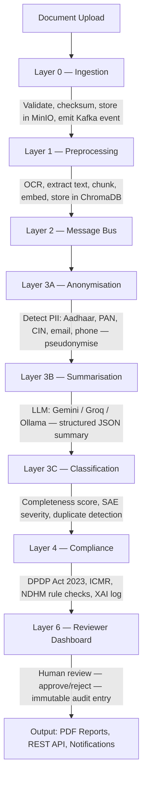

# SwasthaAI — AI-Powered CDSCO Regulatory Platform

<div align="center">

**CDSCO-IndiaAI Health Innovation Acceleration Hackathon Entry**
*AI-Driven Regulatory Workflow Automation and Data Anonymisation*

[](https://satviksri-swastha-ai-backend.hf.space/)
[](https://swastha-ai.vercel.app)
[](https://github.com/satvik-svg/swastha-ai-hf)
[](./LICENSE)

</div>

---

## What is SwasthaAI?

SwasthaAI is an **end-to-end, enterprise-grade AI platform** that automates India's CDSCO (Central Drugs Standard Control Organisation) regulatory document review pipeline. It ingests submissions from the SUGAM and MD Online government portals, processes them through a 7-layer AI architecture, and surfaces results in a reviewer dashboard — replacing the current slow, manual process.

### Problem Statement

CDSCO currently reviews thousands of documents manually: drug submissions, medical device applications, clinical trial protocols, and Serious Adverse Event (SAE) reports. This bottleneck delays the approval of life-saving medicines. SwasthaAI uses AI to:

1. **Anonymise** all PII/PHI before AI processing (DPDP Act 2023 compliant)
2. **Summarise** high-volume regulatory documents into structured, standardised text
3. **Classify** submissions by severity and completeness
4. **Compare** document versions and generate formal inspection reports

---

## System Architecture — 7 Layers

<p align="center">
  
</p>

| Layer | Name | Technology | Status |
|-------|------|-----------|--------|
| **0** | Portal Ingestion | FastAPI, MinIO, SHA-256, ClamAV | Live |
| **1** | Preprocessing Engine | PyMuPDF, Tesseract OCR, sentence-transformers, ChromaDB | Live |
| **2** | Message Bus | Apache Kafka (KRaft), Avro, Schema Registry, Redis | Live |
| **3** | AI Core | Google Gemini 1.5, Groq/Llama 3, Ollama (offline), Microsoft Presidio | Live |
| **4** | Compliance and Governance | DPDP 2023, ICMR, NDHM rule engines, XAI Decision Log | Live |
| **5** | Data Storage | Supabase PostgreSQL 15, MinIO S3, ChromaDB, Redis | Live |
| **6** | Output and Delivery | React Dashboard (Vite + TanStack Query), PDF Reports | Live |

---

## AI Processing Pipeline



### LLM Fallback Chain

```
Gemini 1.5 Flash  -->  Groq / Llama 3 70B  -->  Anthropic Claude  -->  Ollama (offline)
```

Model behaviour is controlled by `AI_CORE_MODEL_MODE` in `.env`.

---

## Deployment

The platform uses a **hybrid-cloud strategy** — enterprise AI capabilities at zero cost:

| Component | Provider | Details |
|-----------|----------|---------|
| **Backend (API + AI)** | [Hugging Face Spaces](https://satviksri-swastha-ai-backend.hf.space/) | 16 GB RAM Docker Space running FastAPI + Redis + MinIO |
| **Database** | Supabase | PostgreSQL 15, connected via IPv4 Session Pooler (Port 5432) with asyncpg |
| **Frontend** | Vercel | React + Vite dashboard, auto-deploys on push |

> **Stage 2 (On-Premises):** The entire stack is containerised. The LLM layer falls back to local Ollama automatically when cloud APIs are unavailable — making this fully air-gap capable for the CDSCO office deployment.

---

## Repository Structure

```
swastha-ai/                              # Root repository
├── swastha-ai/                          # Python application root
│   ├── app/                             # FastAPI backend source (Layers 0–4)
│   │   ├── main.py                      # Application entrypoint and lifespan manager
│   │   ├── config.py                    # Pydantic Settings configuration
│   │   ├── dependencies.py              # Redis and shared dependency injection
│   │   ├── ai_core/                     # Layer 3: Anonymisation, Summarisation, Classification, Comparison
│   │   │   ├── anonymisation.py         # Microsoft Presidio + custom Indian PII regex
│   │   │   ├── summarisation.py         # LLM-based structured document summarisation
│   │   │   ├── classification.py        # Completeness scoring and SAE severity classification
│   │   │   ├── comparison.py            # Version diff and change narration
│   │   │   ├── llm_client.py            # Multi-provider LLM client (Gemini/Groq/Claude/Ollama)
│   │   │   └── pipeline.py             # Orchestrates all AI core modules
│   │   ├── compliance/                  # Layer 4: DPDP, ICMR, NDHM rule engines + XAI log
│   │   │   ├── dpdp.py                  # Digital Personal Data Protection Act 2023 checks
│   │   │   ├── icmr.py                  # ICMR clinical trial guideline validation
│   │   │   ├── ndhm.py                  # NDHM health data standards checks
│   │   │   ├── xai.py                   # Explainability audit logger
│   │   │   └── pii_leak_detector.py     # Post-anonymisation PII leak verification
│   │   ├── preprocessing/               # Layer 1: OCR, extractors, embeddings, chunking
│   │   │   ├── ocr/                     # Tesseract and PyMuPDF text extraction
│   │   │   ├── extractors/              # PDF, DOCX, XML, CSV format parsers
│   │   │   ├── chunker/                 # Semantic text chunking strategies
│   │   │   ├── embedder/                # sentence-transformers vector embeddings
│   │   │   └── normaliser/              # Text normalisation and language detection
│   │   ├── ingestion/                   # Layer 0: Ingestion pipeline and portal adapters
│   │   ├── messagebus/                  # Layer 2: Kafka producer, consumer, DLQ, circuit breaker
│   │   ├── adapters/                    # SUGAM and MD Online portal adapters
│   │   ├── output/                      # Layer 6: Dashboard API, PDF report generation
│   │   ├── audit/                       # Immutable, chain-hashed audit log writer
│   │   ├── auth/                        # Keycloak JWT + API key authentication
│   │   ├── middleware/                  # Request ID injection, security headers
│   │   ├── storage/                     # MinIO S3-compatible object storage client
│   │   ├── queue/                       # Kafka producer and in-process fallback queue
│   │   ├── rate_limit/                  # Sliding window rate limiter per IP/user
│   │   └── db/                          # SQLAlchemy models and async connection pool
│   ├── frontend/                        # React + Vite reviewer dashboard (Layer 6)
│   │   └── src/
│   │       ├── pages/                   # Dashboard, SubmissionsQueue, SubmissionDetail,
│   │       │                            # Compliance, Settings, Explainability
│   │       ├── components/              # Layout (sidebar + header)
│   │       └── lib/                     # Type-safe API client (axios + TanStack Query)
│   ├── tests/                           # Comprehensive test suite
│   │   ├── ai_core/                     # AI module unit tests
│   │   ├── compliance/                  # Compliance engine tests
│   │   ├── preprocessing/               # Preprocessor tests
│   │   ├── messagebus/                  # Kafka integration tests
│   │   ├── test_ingestion.py            # Ingestion endpoint tests
│   │   ├── test_auth.py                 # Authentication and authorisation tests
│   │   ├── test_validators.py           # Input validation tests
│   │   └── test_adapters.py             # Portal adapter tests
│   ├── alembic/                         # Database migration scripts
│   ├── kafka/                           # Avro schemas, topic configs, Kafka setup scripts
│   ├── scripts/                         # Test runners and environment bootstrap
│   ├── docker-compose.yml               # Full local stack (Postgres, MinIO, Redis, Kafka, Keycloak, ChromaDB)
│   ├── docker-compose.layer1.yml        # Layer 1 isolated compose
│   ├── docker-compose.layer2.yml        # Layer 2 isolated compose
│   ├── Dockerfile                       # Single-stage Python container
│   ├── Dockerfile.hf                    # Hugging Face Spaces optimised container
│   ├── requirements.txt                 # Python dependencies
│   ├── requirements-test.txt            # Test dependencies
│   ├── prometheus_alerts.yml            # Prometheus alerting rules
│   ├── grafana_dashboard.json           # Pre-built Grafana monitoring dashboard
│   └── .env.example                     # Environment variable template
├── DOCUMENTATION.md                     # Changelog and technical history
├── context.md                           # Detailed architectural context document
└── cdsco_indiaai_full_architecture.svg  # Full system architecture diagram
```

---

## Quick Start — Local Development

### Prerequisites

- Python 3.11 or higher
- Node.js 18 or higher and npm
- Docker Desktop (for MinIO, Redis, Kafka, and ChromaDB containers)

### 1. Backend

```bash
cd swastha-ai

# Create virtual environment
python -m venv .venv
source .venv/bin/activate        # macOS/Linux
# .\.venv\Scripts\activate       # Windows PowerShell

# Install dependencies
pip install -r requirements.txt
pip install "numpy<2.0.0" groq google-generativeai

# Configure environment
cp .env.example .env
# Edit .env — fill in SUPABASE, GROQ_API_KEY or GEMINI_API_KEY

# Start MinIO and Redis via Docker
docker-compose up -d minio redis

# Run the server
uvicorn app.main:app --host 0.0.0.0 --port 8000 --reload
```

Backend API and Swagger UI: **http://localhost:8000/docs**

### 2. Frontend

```bash
cd swastha-ai/frontend

# Install dependencies
npm install

# Configure environment
echo "VITE_API_BASE_URL=http://localhost:8000" > .env
echo "VITE_API_KEY=b7f8c9d2a1e43b56c7d8e9f0a1b2c3d4" >> .env

# Start development server
npm run dev
```

Dashboard: **http://localhost:5173**

---

## Testing the Platform

1. Open the dashboard at `http://localhost:5173`.
2. Click **Upload Document** from the sidebar or dashboard header.
3. Select a document type: **SAE Report**, **Drug Submission**, **Medical Device Application**, or **Clinical Trial Protocol**.
4. Upload a PDF and observe the real-time AI analysis pipeline execute across all layers.
5. Review the generated summary, compliance report, and explainability log on the Submission Detail page.

### Running Automated Tests

```bash
cd swastha-ai

# Install test dependencies
pip install -r requirements-test.txt

# Run all tests
pytest

# Run specific test file with verbose output
pytest tests/test_ingestion.py -v
```

---

## Security and Compliance

| Area | Implementation |
|------|----------------|
| **DPDP Act 2023** | All PII/PHI is anonymised before reaching the LLM — patient data never leaves as plaintext. |
| **Immutable Audit Log** | SHA-256 chain-hashed append-only audit trail; `UPDATE`/`DELETE` revoked at the database level. |
| **XAI Ledger** | Every AI decision is recorded with model ID, version, confidence score, and rationale bullets. |
| **Authentication** | Dual-mode: `X-API-Key` header for machine-to-machine; Keycloak JWT Bearer for interactive sessions. |
| **Object Storage** | MinIO with SSE-S3 encryption and 10-year document retention policy. |
| **Role-Based Access** | Four roles: `admin`, `reviewer`, `portal_operator`, `api_client` — each with scoped permissions. |
| **Network Security** | TLS 1.3 in production, security headers middleware, rate limiting per IP and per user. |

---

## Monitoring and Observability

The platform includes production-grade monitoring out of the box:

- **Prometheus** — custom metrics and alerting rules (`prometheus_alerts.yml`)
- **Grafana** — pre-built dashboard for API latency, throughput, and AI model performance (`grafana_dashboard.json`)
- **Structured Logging** — JSON-formatted logs with request ID tracing across all layers
- **Health Checks** — every service exposes a health endpoint used by Docker and Kubernetes readiness probes

---

## Hugging Face Space-Backend

| Repository | Purpose |
|------------|---------|
| [satvik-svg/swastha-ai-hf](https://github.com/satvik-svg/swastha-ai-hf) | Hugging Face Docker Space — hosts the production backend |

---

## Hackathon Details

| Field | Value |
|-------|-------|
| **Hackathon** | IndiaAI x CDSCO Health Innovation Acceleration Hackathon |
| **Ministry** | Electronics and IT (MeitY) / Central Drugs Standard Control Organisation |
| **Problem Statement** | AI-Driven Regulatory Workflow Automation and Data Anonymisation |
| **Target Portals** | SUGAM, MD Online |
| **Key Frameworks** | DPDP Act 2023, ICMR Guidelines, NDHM Standards |

---

*Developed for the CDSCO-IndiaAI Health Innovation Hackathon. All AI decisions require human reviewer verification before regulatory action.*
