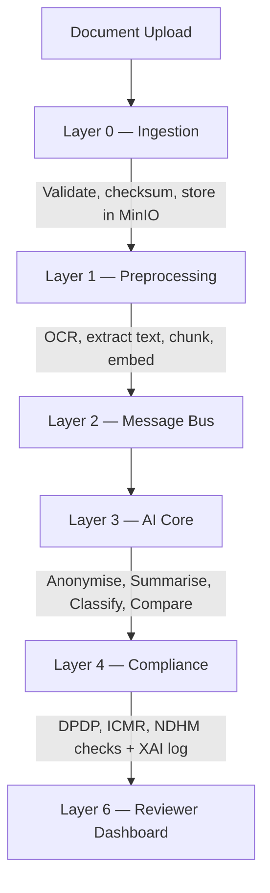

# SwasthaAI — CDSCO Regulatory AI Platform

> **Revolutionising CDSCO regulatory processing with an enterprise-grade, 7-layer AI architecture.**
> Entry for the CDSCO-IndiaAI Health Innovation Acceleration Hackathon.

<div align="center">

[](https://satviksri-swastha-ai-backend.hf.space/)
[](https://swastha-ai.vercel.app)
[](../LICENSE)

</div>

SwasthaAI automates the ingestion, PII-anonymisation, and intelligent analysis of critical regulatory documents including Drug Submissions, Medical Device Applications, Clinical Trial Protocols, and SAE Reports.

---

## Key Features

- **Intelligent Summarisation** — Uses Google Gemini 1.5 and Llama 3 to generate structured executive summaries with a multi-model fallback chain.
- **Data Privacy First** — Automated Indian PII/PHI scrubbing (Aadhaar, PAN, CIN, phone, email, DOB) via Microsoft Presidio and custom regex rules.
- **Automated Compliance** — Instant rule-engine checks against DPDP Act 2023, ICMR Guidelines, and NDHM Standards.
- **Explainable AI** — Every AI decision is recorded with model ID, version, confidence score, and human-readable rationale.
- **7-Layer Architecture** — Decoupled, scalable design from Portal Ingestion to Output and Delivery.
- **High-Performance Backend** — FastAPI with asynchronous database operations via Supabase PostgreSQL and asyncpg.
- **Event-Driven Pipeline** — Apache Kafka message bus with at-least-once delivery, dead-letter queues, and circuit breakers.

---

## Architecture

<p align="center">
  
</p>

### Pipeline Flow



### LLM Fallback Chain

```
Gemini 1.5 Flash  -->  Groq / Llama 3 70B  -->  Anthropic Claude  -->  Ollama (offline)
```

Controlled by `AI_CORE_MODEL_MODE` in `.env`.

---

## Local Development Setup

Follow these steps to get the full platform running on your local machine.

### Prerequisites

- Python 3.11 or higher
- Node.js 18 or higher and npm
- Docker Desktop (required for local MinIO and Redis)

---

### Backend Setup (FastAPI)

```bash
# Navigate to the application root
cd swastha-ai

# Create and activate virtual environment
python -m venv .venv
source .venv/bin/activate        # macOS/Linux
# .\.venv\Scripts\activate       # Windows PowerShell

# Install dependencies
pip install -r requirements.txt
pip install "numpy<2.0.0" groq google-generativeai

# Set up environment variables
cp .env.example .env
# Edit .env and fill in your Supabase, Gemini, and Groq keys

# Start supporting services (MinIO and Redis)
docker-compose up -d minio redis

# Run the backend server
uvicorn app.main:app --host 0.0.0.0 --port 8000 --reload
```

Backend API and Swagger UI: **http://localhost:8000/docs**

---

### Frontend Setup (React + Vite)

Open a new terminal window:

```bash
# Navigate to the frontend directory
cd swastha-ai/frontend

# Install dependencies
npm install

# Set up environment variables
echo "VITE_API_BASE_URL=http://localhost:8000" > .env
echo "VITE_API_KEY=b7f8c9d2a1e43b56c7d8e9f0a1b2c3d4" >> .env

# Start the development server
npm run dev
```

Dashboard: **http://localhost:5173**

---

## Project Structure

| Directory | Description |
|-----------|-------------|
| `app/` | FastAPI backend source code — Layers 0 through 4 |
| `app/ai_core/` | Layer 3: Anonymisation, Summarisation, Classification, Comparison |
| `app/compliance/` | Layer 4: DPDP, ICMR, NDHM rule engines and XAI decision log |
| `app/preprocessing/` | Layer 1: OCR, format parsers, chunking, embeddings |
| `app/ingestion/` | Layer 0: Ingestion pipeline and validation |
| `app/adapters/` | SUGAM and MD Online portal adapters |
| `app/output/` | Layer 6: Dashboard API endpoints and PDF report generation |
| `frontend/` | React + Vite reviewer dashboard (Layer 6) |
| `tests/` | Comprehensive test suite (ingestion, auth, AI core, compliance) |
| `alembic/` | Database migration scripts |
| `kafka/` | Avro schemas, topic configurations, and Kafka setup scripts |
| `scripts/` | Test runners and environment bootstrap utilities |

---

## Testing

### Manual Testing

1. Open the dashboard at `http://localhost:5173`.
2. Click **Upload Document**.
3. Select **SAE Report** or **Drug Submission**.
4. Upload a PDF and observe the real-time AI analysis.
5. Review the summary, compliance report, and explainability log.

### Automated Testing

```bash
# Install test dependencies
pip install -r requirements-test.txt

# Run all tests
pytest

# Run specific test file with verbose output
pytest tests/test_ingestion.py -v
```

---

## Security

| Area | Implementation |
|------|----------------|
| **Immutable Audit** | Append-only audit logs; `UPDATE` and `DELETE` are revoked at the database level. |
| **Authentication** | All requests secured via `X-API-Key` headers and Keycloak-ready JWT handlers. |
| **Anonymisation** | All data is scrubbed of PII before reaching the LLM or being stored for reviewers. |
| **Role-Based Access** | Four roles (`admin`, `reviewer`, `portal_operator`, `api_client`) with scoped permissions. |
| **Rate Limiting** | Sliding window rate limiter per IP and per user with IP blocking. |

---

## Deployment

| Component | Provider | URL |
|-----------|----------|-----|
| **Backend** | Hugging Face Spaces | [satviksri-swastha-ai-backend.hf.space](https://satviksri-swastha-ai-backend.hf.space/) |
| **Frontend** | Vercel | [swastha-ai.vercel.app](https://swastha-ai.vercel.app) |
| **Database** | Supabase | PostgreSQL 15 via IPv4 Session Pooler |

---

*Developed for the CDSCO-IndiaAI Health Innovation Acceleration Hackathon. All AI decisions require human reviewer verification before regulatory action.*
